---
## Front matter
lang: ru-RU
title: Лабораторная работа № 7
subtitle: 
author:
  - Симонова В.И.
institute:
  - Российский университет дружбы народов, Москва, Россия
  - НКАбд-05-23
date: 21 марта 2024

## i18n babel
babel-lang: russian
babel-otherlangs: english

## Formatting pdf
toc: false
toc-title: Содержание
slide_level: 2
aspectratio: 169
section-titles: true
theme: metropolis
header-includes:
 - \metroset{progressbar=frametitle,sectionpage=progressbar,numbering=fraction}
 - '\makeatletter'
 - '\beamer@ignorenonframefalse'
 - '\makeatother'

## Fonts
mainfont: PT Serif
romanfont: PT Serif
sansfont: PT Sans
monofont: PT Mono
mainfontoptions: Ligatures=TeX
romanfontoptions: Ligatures=TeX
sansfontoptions: Ligatures=TeX,Scale=MatchLowercase
monofontoptions: Scale=MatchLowercase,Scale=0.9
---

## Докладчик

:::::::::::::: {.columns align=center}
::: {.column width="70%"}

  * Симонова Виктория Игоревна
  * Студент 
  * НКАбд-05-23
  * Российский университет дружбы народов
  * [1132236012@pfur.ru](mailto:1132236012@rudn.ru)

:::
::: {.column width="30%"}

:::
::::::::::::::

# Цель работы

Ознакомление с файловой системой Linux, её структурой, именами и содержанием
каталогов. Приобретение практических навыков по применению команд для работы
с файлами и каталогами, по управлению процессами (и работами), по проверке исполь-
зования диска и обслуживанию файловой системы.

# Задание

1. Выполнить все примеры из лабораторной работы
2. Выполнить команды по копированию, созданию и перемещению файлов и каталогов
3. Определить опции команды chmod
4. Изменить права доступа к файлам
5. Прочитать документацию о командах mount, fsck, mkfs, kill

# Теоретическое введение

Для создания текстового файла можно использовать команду touch. Для просмотра файлов небольшого размера можно использовать команду cat. Для просмотра файлов постранично удобнее использовать команду less. Команда cp используется для копирования файлов и каталогов. Команды mv и mvdir предназначены для перемещения и переименования файлов и каталогов.

Каждый файл или каталог имеет права доступа.
В сведениях о файле или каталоге указываются:

– тип файла (символ (-) обозначает файл, а символ (d) — каталог);

– права для владельца файла (r — разрешено чтение, w — разрешена запись, x — разрешено выполнение, - — право доступа отсутствует);

– права для членов группы (r — разрешено чтение, w — разрешена запись, x — разрешено
выполнение, - — право доступа отсутствует);

– права для всех остальных (r — разрешено чтение, w — разрешена запись, x — разрешено
выполнение, - — право доступа отсутствует).

Права доступа к файлу или каталогу можно изменить, воспользовавшись командой
chmod. Сделать это может владелец файла (или каталога) или пользователь с правами
администратора.

##

Файловая система в Linux состоит из фалов и каталогов. Каждому физическому носителю соответствует своя файловая система.
Существует несколько типов файловых систем. Перечислим наиболее часто встречающиеся типы:

– ext2fs (second extended filesystem);

– ext2fs (third extended file system);

– ext4 (fourth extended file system);

– ReiserFS;

– xfs;

– fat (file allocation table);

– ntfs (new technology file system).

Для просмотра используемых в операционной системе файловых систем можно вос-
пользоваться командой mount без параметров.

# Выполнение лабораторной работы

Выполняю примеры, приведённые в лабоаторной работе . Создаю и копирую файл abc1. Копирование файла в текущем каталоге. Скопировать файл ~/abc1 в файл april
и в файл may 
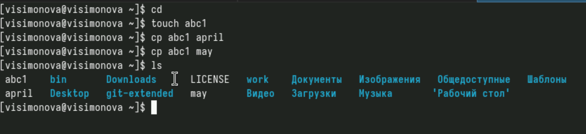

##

Скопировать файлы april и may в каталог monthly, который я создала заранее 

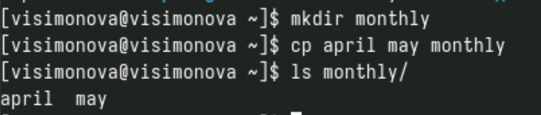

##

Копирование файлов в произвольном каталоге. Скопировала файл monthly/may в файл
с именем june 

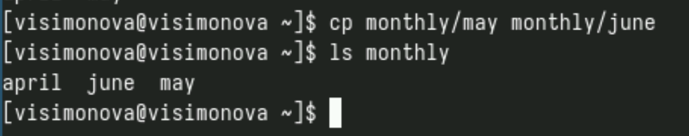

##

Копирование каталогов в текущем каталоге. Скопировать каталог monthly в каталог
monthly.00 Копирование каталогов в произвольном каталоге. Скопировать каталог monthly.00
в каталог /tmp 

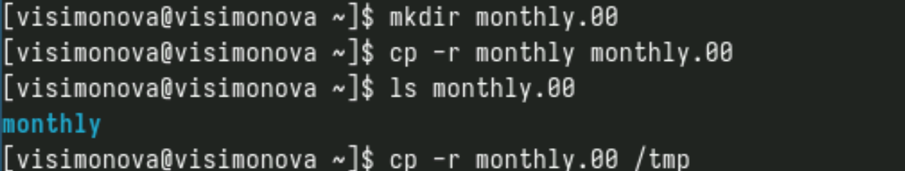

##

Переименование файлов в текущем каталоге. Изменяю название файла april на
july в домашнем каталоге 

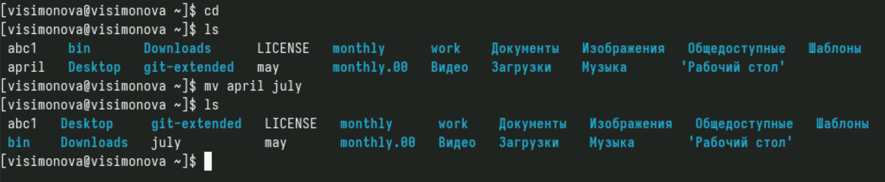

##

Перемещение файлов в другой каталог. Перемещаю файл july в каталог monthly.00 

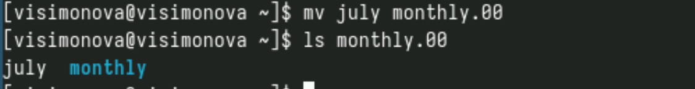

##

Переименование каталогов в текущем каталоге. Переименовать каталог monthly.00
в monthly.01. Перемещение каталога в другой каталог. Переместить каталог monthly.01в каталог
reports 

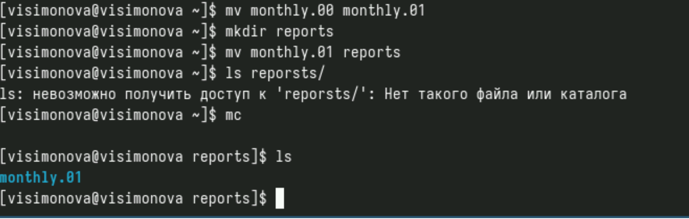

##

Переименование каталога, не являющегося текущим. Переименовать каталог
reports/monthly.01 в reports/monthly 

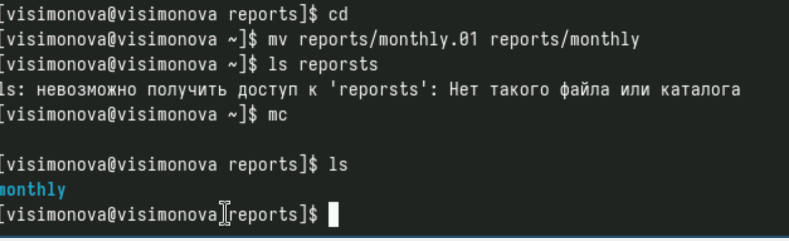

##

Создаю файл ~/may с правом выполнения для владельца 

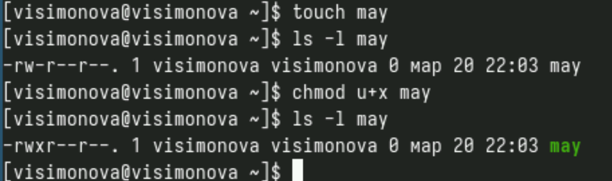

##

Лишаю владельца файла ~/may права на выполнение 

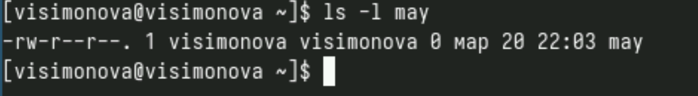

##

Создать каталог monthly с запретом на чтение для членов группы и всех
остальных пользователей 

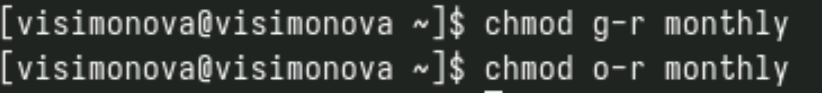

##

Создать файл ~/abc1 с правом записи для членов группы 

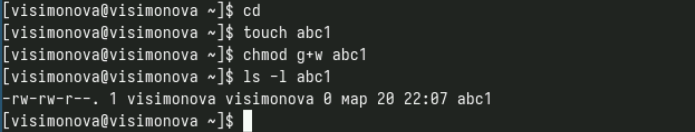

##

С помощью команды fsck можно проверить (а в ряде случаев восстановить) целост-
ность файловой системы 

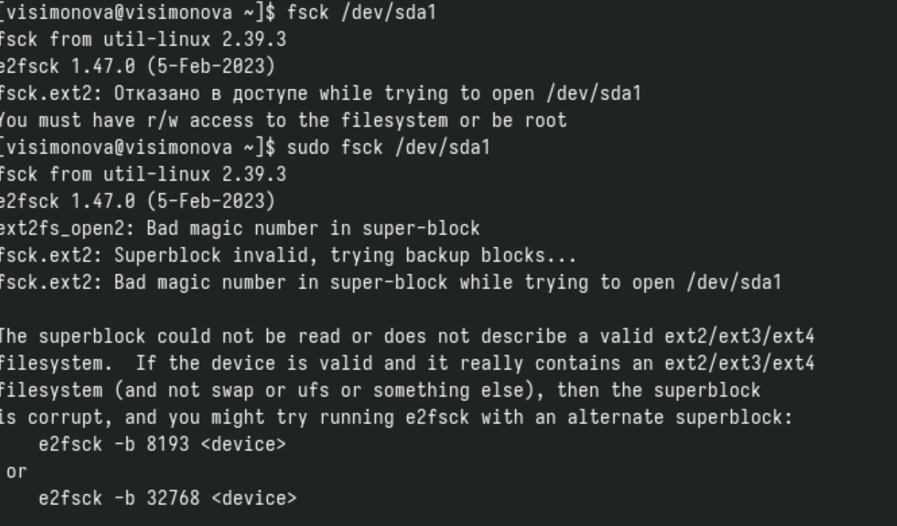

##

Копирую файл /usr/include/sys/io.h в домашний каталог и назовите его
equipment. Создайте директорию. Переместите файл equipment в каталог ~/ski.plases 

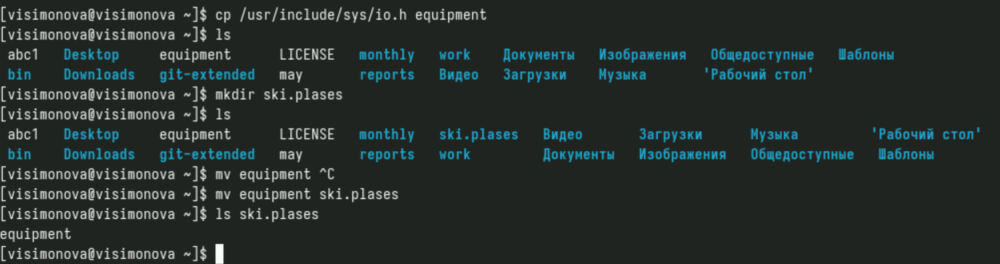

##

Переименуйте файл ~/ski.plases/equipment в ~/ski.plases/equiplist 

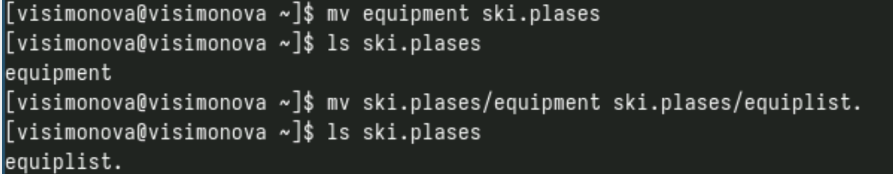

##

Создайте в домашнем каталоге файл abc1 и скопируйте его в каталог
~/ski.plases, назовите его equiplist2. Создайте и переместите каталог ~/newdir в каталог ~/ski.plases и назовите
его plans 

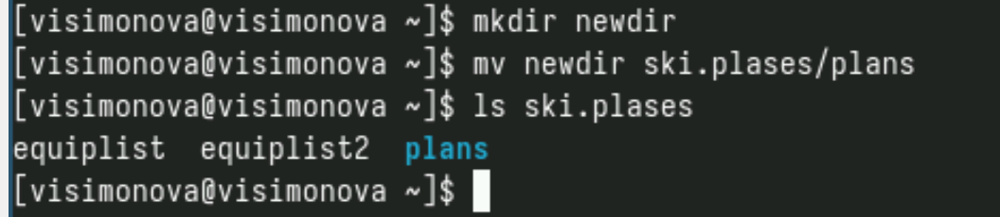

##

Вожу команду chmod с необходимыми опциями(по заданию) для каталога australia 

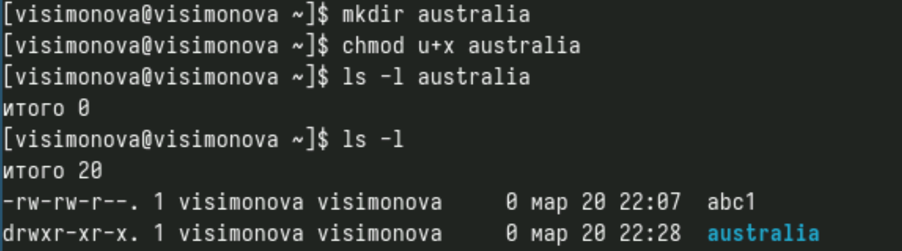

##

Вожу команду chmod с необходимыми опциями(по заданию) для каталога play 

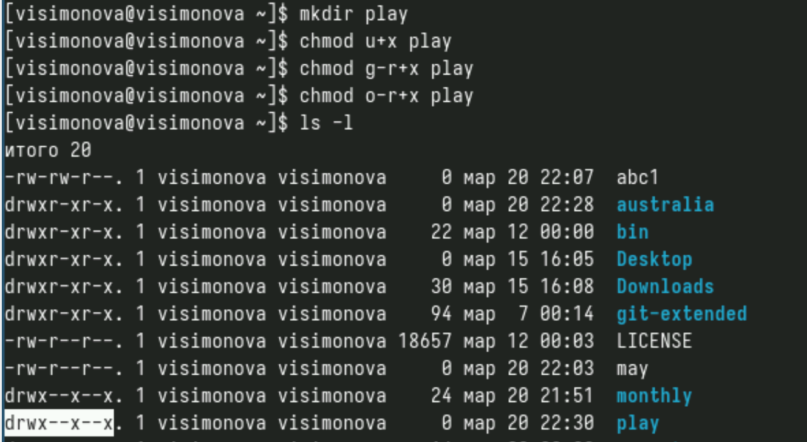

##

Вожу команду chmod с необходимыми опциями(по заданию) для файла my_os. Вожу команду chmod с необходимыми опциями(по заданию) для файла feathers 

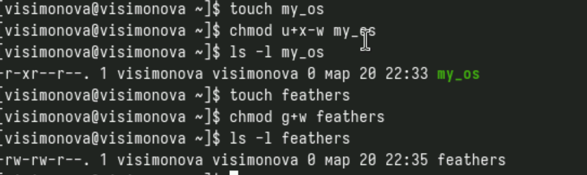

##

Просмотрите содержимое файла /etc/password 

![Содержимое] ](image/20.png)

##

Скопируйте файл ~/feathers в файл ~/file.old. Переместите файл ~/file.old в каталог ~/play. Скопируйте каталог ~/play в каталог ~/fun. 

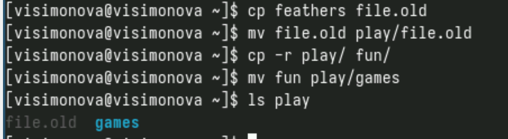

##

Лишите владельца файла ~/feathers права на чтение. Что произойдёт, если вы попытаетесь просмотреть файл ~/feathers командой
cat? Что произойдёт, если вы попытаетесь скопировать файл ~/feathers? Дайте владельцу файла ~/feathers право на чтение. 

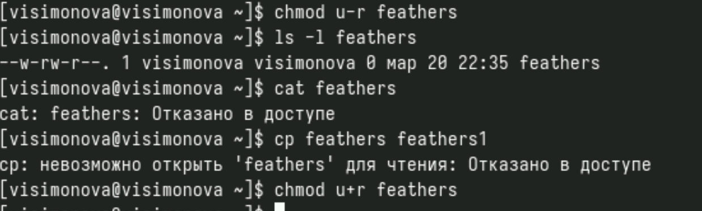

##

Лишите владельца каталога ~/play права на выполнение. Перейдите в каталог ~/play. Что произошло? Дайте владельцу каталога ~/play право на выполнение 

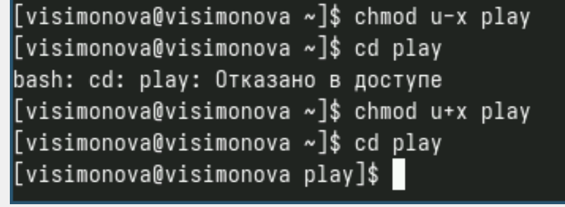

##

По man по командам mount, fsck, mkfs, kill и кратко их охарактеризуйте,
приведя примеры
- mount — утилита командной строки в UNIX-подобных операционных системах. Применяется для монтирования файловых систем.
- fsck (проверка файловой системы) - это утилита командной строки, которая позволяет выполнять проверки согласованности и интерактивное исправление в одной или нескольких файловых системах Linux. Он использует программы, специфичные для типа файловой системы, которую он проверяет.
- mkfs используется для создания файловой системы Linux на некотором устройстве, обычно в разделе жёсткого диска. В качестве аргумента filesys для файловой системы может выступать или название устройства
- Команда Kill посылает указанный сигнал указанному процессу. Если не указано ни одного сигнала, посылается сигнал SIGTERM. Сигнал SIGTERM завершает лишь те процессы, которые не обрабатывают его приход. Для других процессов может быть необходимым послать сигнал SIGKILL, поскольку этот сигнал перехватить невозможно. 

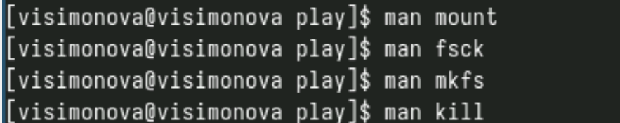

# Список литературы{.unnumbered}

::: {#refs}
:::

1. Dash, P. Getting Started with Oracle VM VirtualBox / P. Dash. – Packt Publishing Ltd, 2013. – 86 сс.
2. Colvin, H. VirtualBox: An Ultimate Guide Book on Virtualization with VirtualBox. VirtualBox / H. Colvin. – CreateSpace Independent Publishing Platform, 2015. – 70 сс.
3. Vugt, S. van. Red Hat RHCSA/RHCE 7 cert guide : Red Hat Enterprise Linux 7 (EX200 and EX300) : Certification Guide. Red Hat RHCSA/RHCE 7 cert guide / S. van Vugt. – Pearson IT Certification, 2016. – 1008 сс.
4. Робачевский, А. Операционная система UNIX / А. Робачевский, С. Немнюгин, О. Стесик. – 2-е изд. – Санкт-Петербург : БХВ-Петербург, 2010. – 656 сс.
5. Немет, Э. Unix и Linux: руководство системного администратора. Unix и Linux / Э. Немет, Г. Снайдер, Т.Р. Хейн, Б. Уэйли. – 4-е изд. – Вильямс, 2014. – 1312 сс.
6. Колисниченко, Д.Н. Самоучитель системного администратора Linux : Системный администратор / Д.Н. Колисниченко. – Санкт-Петербург : БХВ-Петербург, 2011. – 544 сс.
7. Robbins, A. Bash Pocket Reference / A. Robbins. – O’Reilly Media, 2016. – 156 сс.