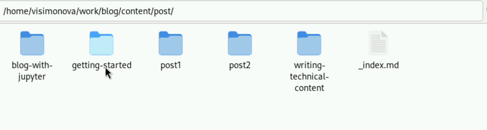

---
## Front matter
lang: ru-RU
title: Отчёт по 2 этапу индивидуального проекта
subtitle: Операционные системы
author:
  - Симонова В.И.
institute:
  - Российский университет дружбы народов, Москва, Россия
  - НКАбд-05-23
date: 14 марта 2024

## i18n babel
babel-lang: russian
babel-otherlangs: english

## Formatting pdf
toc: false
toc-title: Содержание
slide_level: 2
aspectratio: 169
section-titles: true
theme: metropolis
header-includes:
 - \metroset{progressbar=frametitle,sectionpage=progressbar,numbering=fraction}
 - '\makeatletter'
 - '\beamer@ignorenonframefalse'
 - '\makeatother'

## Fonts
mainfont: PT Serif
romanfont: PT Serif
sansfont: PT Sans
monofont: PT Mono
mainfontoptions: Ligatures=TeX
romanfontoptions: Ligatures=TeX
sansfontoptions: Ligatures=TeX,Scale=MatchLowercase
monofontoptions: Scale=MatchLowercase,Scale=0.9
---

## Докладчик

:::::::::::::: {.columns align=center}
::: {.column width="70%"}

  * Симонова Виктория Игоревна
  * Студент 
  * НКАбд-05-23
  * Российский университет дружбы народов
  * [1132236012@pfur.ru](mailto:1132236012@rudn.ru)

:::
::: {.column width="30%"}

:::
::::::::::::::

# Цель работы

Продолжить работы со своим сайтом. Редактировать его в соответствии с требованиями. Добавить данные о себе.

# Задание

Добавить на сайт информацию 
Список добавляемых данных.
* Разместить фотографию владельца сайта.
* Разместить краткое описание владельца сайта (Biography).
* Добавить информацию об интересах (Interests).
** Добавить информацию от образовании (Education).
** Сделать пост по прошедшей неделе.
** Добавить пост на тему по выбору:
** Управление версиями. Git.
** Непрерывная интеграция и непрерывное развертывание (CI/CD).

# Выполнение лабораторной работы

Меняю фотографию на свою 

##

Изменяю информацию сайта на информацию о себе 

##

Информация о моём образнии 

##

Проверяю, что всё получилось 

##

Создаю паку для поста с информацией о моей прошедшей неделе 

##

Пишу пост 

##

Проверяю, что пост выложен на сайте 

##

Содержание поста тоже синхронизировалось, ссылки работают картинки есть 

##

Создаю паку для поста с информацией о версионировании гит 

##

Пишу пост

##

Проверяю, что пост выложен на сайте 

##

Содержание поста тоже синхронизировалось, ссылки работают 

##

Отправляю изменения на гитхаб 

##

Отправляю изменения из папки public, чтобы сайт был доступен не только с хостинга 

##

Открываю сайт в браузере chrome, основной операционной системы, тем самым убеждаюсь, что ссылка работает 

## Вывод

Размесстила изменённый под себя сайт

## Список литературы

# Список литературы{.unnumbered}

1. Dash, P. Getting Started with Oracle VM VirtualBox / P. Dash. – Packt Publishing Ltd, 2013. – 86 сс.
2. Colvin, H. VirtualBox: An Ultimate Guide Book on Virtualization with VirtualBox. VirtualBox / H. Colvin. – CreateSpace Independent Publishing Platform, 2015. – 70 сс.
3. Vugt, S. van. Red Hat RHCSA/RHCE 7 cert guide : Red Hat Enterprise Linux 7 (EX200 and EX300) : Certification Guide. Red Hat RHCSA/RHCE 7 cert guide / S. van Vugt. – Pearson IT Certification, 2016. – 1008 сс.
4. Робачевский, А. Операционная система UNIX / А. Робачевский, С. Немнюгин, О. Стесик. – 2-е изд. – Санкт-Петербург : БХВ-Петербург, 2010. – 656 сс.
5. Немет, Э. Unix и Linux: руководство системного администратора. Unix и Linux / Э. Немет, Г. Снайдер, Т.Р. Хейн, Б. Уэйли. – 4-е изд. – Вильямс, 2014. – 1312 сс.
6. Колисниченко, Д.Н. Самоучитель системного администратора Linux : Системный администратор / Д.Н. Колисниченко. – Санкт-Петербург : БХВ-Петербург, 2011. – 544 сс.
7. Robbins, A. Bash Pocket Reference / A. Robbins. – O’Reilly Media, 2016. – 156 сс.